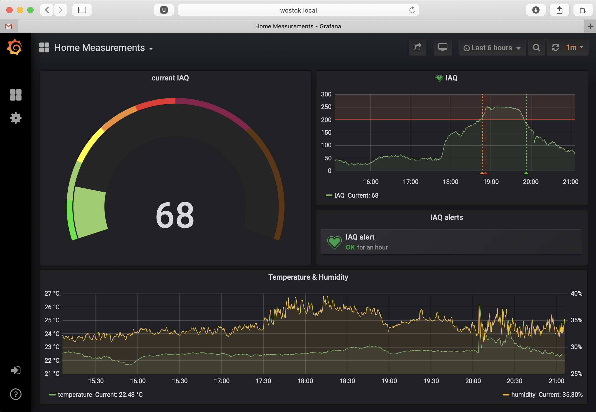
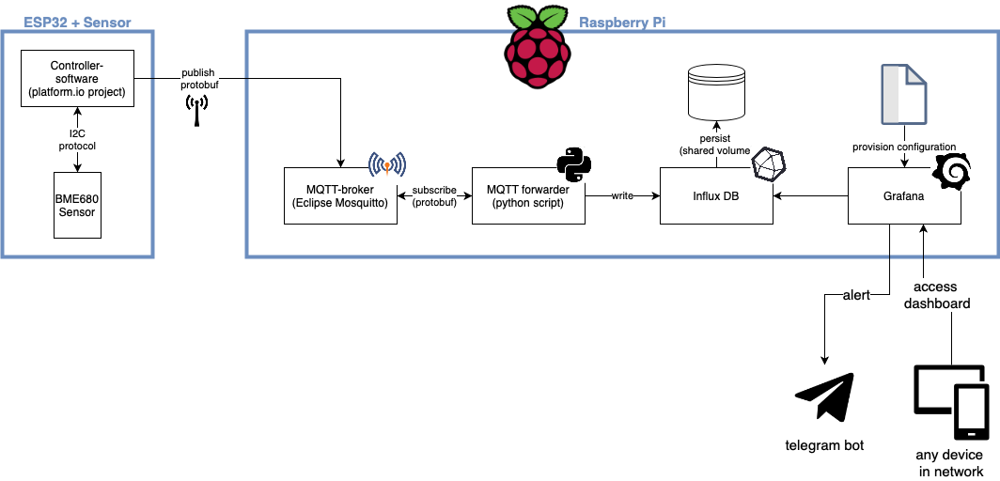

# Indoor air quality monitoring
From (indoor air quality) measurement to dashboard without any manual configuration.

## Table of contents
* [Goal](#Goal)
  * [Additional technical requirements](#Additional-technical-requirements)
* [Realization](#Realization)
  * [Measuring and sending data with the ESP32](#Measuring-and-sending-data-with-the-ESP32)
  * [Processing, storing, and displaying data on the Raspberry Pi](#Processing,-storing,-and-displaying-data-on-the-Raspberry-Pi)
  * [Compiling the protocol buffers](#Compiling-the-protocol-buffers)
* [Shopping list](#Shopping-list)
* [How to get started](#How-to-get-started)


## Goal
My goal was to monitor temperature, humidity and indoor air quality (IAQ) in our apartment and display it in a dashboard which should be accessible from within our home network.

### Additional technical requirements
Additional requirements, which were mostly not practically necessary but rather added for educational purposes, where:
* communication between microcontroller and Raspberry Pi with MQTT
* MQTT messages are encoded in protocol buffer (protobuf) format
* software on microcontroller should be fully version controlled, including dependencies
* software on Raspberry Pi should be fully version controlled as well, including all configurations, and all software should be started with one command.



## Realization
This was realized with a BME680 sensor from Bosch connected to a ESP32 which is a powerful microcontroller with, amongst others, wifi connectivity. The backend and frontend run on a Raspberry Pi 3B+. As frontend we use Grafana which also allows for alerting, for example as Telegram notifications on the smart phone. The Grafana dashboard can be accessed from all devices which are connected to the home wifi network.



### Measuring and sending data with the ESP32
The manufacturer of the BME680 sensor provides a library for several controllers, including the ESP8266/ESP32. In contrast to other open-source libraries for the BME-sensor series, the so-called BSEC library includes a self-calibration of the indoor air quality sensors.

The scripts provided were augmented with additional functionality for this project:
* connection to the home wifi, using the standard wifi library for ESP32
* connection and publishing to an MQTT-broker using the pubsub-client library
* encoding of messages to protocol buffers using the nanopb library (more details on protocol buffers below).

PlatformIO was used to program the ESP32. This platform does not only offer the comfort of an IDE (e.g. code completion) but also dependency management. This is a huge improvement compared to Arduino IDE where dependencies are usually installed manually and stored globally. Here, the dependencies are tracked per project which allows to include them into version control and they are installed automatically when building the project. 

Software for the ESP32 is provided in the [esp32_bme680](./esp32_bme680/) folder, detailed instructions can be found in the associated [README](./esp32_bme680/README.md).

### Processing, storing, and displaying data on the Raspberry Pi
The measurements that the ESP32 sent as protobuf-encoded MQTT messages, are then processed, stored and displayed using different software components:
* Eclipse Mosquitto as MQTT broker. The ESP32 publishes messages to a specific topic. Other programs can now subscribe to this topic and receive the messages. The MQTT broker is accessible within the home network and can be used for other projects as well.
* A MQTT forwarder script. A simple python script that subscribes to the MQTT topic, decodes all received messages and stores them in a database.
* An InfluxDB databse where the measurements are stored. A shared volume ensures that the data is persisted when the docker container is shutdown or restarted.
* Grafana which is a dashboarding and monitoring tool. The data is displayed in a dashboard that is accessible in a browser from all devices in the network. Furthermore, notifications can be sent, in this example via the Telegram messaging app. Grafana offers provisioning which means that all configuration, including the dashboard definition, is provided in files and no manual configuration is necessary. 

All these components are running as Docker containers on the Raspberry Pi. Using docker-compose, the whole stack can be started with one single command. Running them as Docker containers offers many advantages:
* Preconfigured Docker containers are provided for most open-source projects so that no manual installation is necessary.
* Configuration can be documented and version-controlled using the docker-compose file.
* Dependencies are automatically handled.
* Everything can be started (and shut down) with one command.

Software and more detailed instructions on how to set it up on the Raspberry Pi can be found in the directory [raspberrypi](./raspberrypi/) and the corresponding [README](./raspberrypi/README.md).

### Compiling the protocol buffers
As mentioned before, the messages that are sent from the ESP32 are encoded as protocol buffers. Protocol buffers (short: protobuf) are a language- and platform-neutral mechanism for the serialization and deserialization of structured data. They were developed by Google to be simpler, smaller, faster and easier to maintainer than XML, but even surpass JSON in their performance.

While it is considerably easy to define the message format (see [data.proto](esp32_bme680/src/data.proto)), these proto-files then have to be compiled for each language that they should be used with. Support for several languages, including python, is provided with Google's compiler. Support for other languages is added by the community, namely nanopb for embedded devices like our ESP32.

*Good news is: As long as you do not want to change the message format, there is nothing you have to do as the needed compiled files are included in the repo.*

Note that if, for any reason, you want to change the message format, you need to:
* compile it for the ESP32 (with nanopb) and for the MQTT Forwarder (python)
* change the part where the message is encoded in [main.cpp](esp32_bme680/src/main.cpp) and where it is decoded in [python-listener.py](raspberrypi/mqtt-forwarder/python-listener.py)
* delete the existing InfluxDB database or use a new one in case the schema changes in this process.

The base-compiler protoc as well as nanopb can be installed locally. However to avoid trouble with dependencies, it might be worth considering a dockerized version. You can find more information on the docker image and how to use it on [DockerHub](https://hub.docker.com/repository/docker/buschg/protobuf-compiler/general) (you need a DockerHub account) or [GitHub](https://github.com/gbusch/protobuf-compiler).


## Shopping list
Here is a short overview of the parts that you will need:
* The BME680 sensor from Bosch Sensortec. You probably want to get a breakout board. I got the one from BlueDot. A soldering iron was needed to solder the 6-pin header to the board. There might be boards on the market that have the header already attached. Cost: around 20 €. (If you are not interested in indoor air quality but only temperature and humidity you might want to check out the BME280 which is available for less than 5 €.)
* An ESP32 microcontroller. I used the ESP32 Dev Kit C from az-delivery.de but there are many different versions on the market that should work as well. A ESP8266 can also be used but I failed to fully program it with platformIO without any manual modifications. Cost: around 10 €.
* Jumper wires (female-female) to connect ESP32 and sensor.
* A micro-USB charger to power the ESP32.
* A Raspberry Pi with (micro) SD card and power supply. I got an ABOX (now LABISTS) Raspberry Pi 3B+ starter kit which also contained case, power supply, heat sinks and SD card. Cost: around 85 € (A bare Raspberry Pi costs only half, but I recommend to get one proper kit since you can use it for many other projects at the same time as well).


## How to get started
* Get the parts from the shopping list
* Follow [this description](./esp32_bme680/README.md) to connect the sensor and upload the software to the ESP32. Each time serial output is printed, the LED of the ESP32 blinks. For that reason most ```Serial.println()``` are commented out in the script. You might want to use these statements at first for debugging.
* Follow [this description](./raspberrypi/README.md) to setup the Raspberry Pi.
* You can now point your browser to ```http://<address of your raspberry pi>:3000/d/kpBr4Nzgz/home-measurements?orgId=1``` to see your measurements in a dashboard.