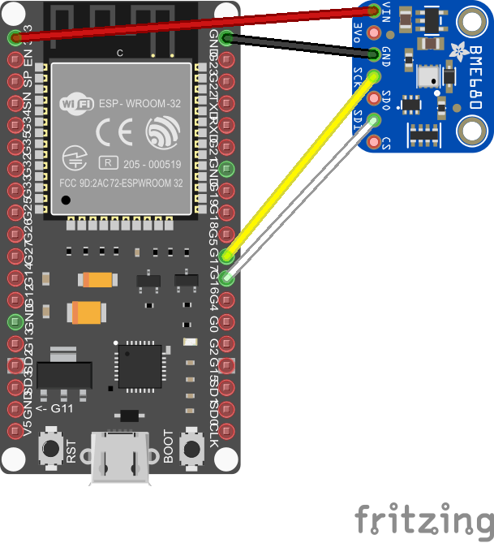

# Setting up the sensor and microcontroller

* Install platform.io (instructions can be found on the [project's webpages](https://platformio.org))

* If you use the ESP32 for the first time, you might need to install USB drivers. My ESP32 board uses a CP2102 USB serial communication interface module for which drivers are provided by Silicon Labs.

* Connect the sensor and microcontroller as indicated in the sketch. 

* Import the directory esp32_bme680 as a new project into platform.io.

* Create a file include/credentials.h and insert your credentials for wifi and MQTT broker (the address of your raspberry pi). The expected schema is shown in the file [credentials.h.example](include/credentials.h.example).

* You can now upload the project to the ESP32 using platform.io.

Note: Most software in this folder, including the precompiled library, is provided by Bosch Sensortec and only slightly modified. All rights remain at Bosch Sensortec.